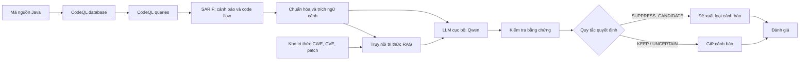

# Kế hoạch triển khai đề tài SAST + LLM + RAG

## 1. Mục tiêu và phạm vi

Đề tài xây dựng và đánh giá một quy trình phát hiện lỗ hổng cho mã Java, trong đó **CodeQL** tạo cảnh báo ban đầu, **LLM chạy cục bộ** đánh giá lại từng cảnh báo, và **RAG** cung cấp tri thức về CWE, nguyên nhân lỗ hổng và điều kiện khắc phục. Mục tiêu chính là giảm false positive (FP) của SAST nhưng vẫn giữ được các cảnh báo true positive (TP).

Quy trình chỉ dùng **CodeQL** làm SAST. Các công cụ như IRIS, Joern, Semgrep, SpotBugs hoặc FindSecBugs chỉ được dùng làm tài liệu tham khảo hay đối chứng học thuật, không được thêm vào tập cảnh báo đầu vào của phương pháp chính.

Phạm vi thực nghiệm ban đầu là ba CWE phổ biến trong Java:

- CWE-22: Path Traversal.
- CWE-78: OS Command Injection.
- CWE-79: Cross-Site Scripting.

Sau khi hoàn thiện pipeline cho một CWE, mới mở rộng sang các CWE còn lại. Việc này giúp xác minh được cơ chế tạo ngữ cảnh, RAG và đánh giá trước khi tăng khối lượng chạy thí nghiệm.

## 2. Kiến trúc đề xuất




Vai trò của từng thành phần:

| Thành phần | Nhiệm vụ | Đầu ra cần lưu |
|---|---|---|
| CodeQL | Phân tích tĩnh, tạo cảnh báo và data/code flow | CodeQL database, SARIF gốc, phiên bản query pack |
| Chuẩn hóa | Đưa cảnh báo về một schema ổn định; loại trùng nhưng không làm mất nguồn gốc | `findings.jsonl`, bảng ánh xạ SARIF |
| Trích ngữ cảnh | Lấy source, sink, code flow, hàm chứa, nhánh kiểm tra và sanitizer liên quan | `contexts.jsonl`, lỗi trích ngữ cảnh nếu có |
| RAG | Truy hồi mục tri thức phù hợp theo CWE, API, hành vi và ngữ cảnh | `retrieval.jsonl`, id/chunk/hash tài liệu |
| LLM | Đánh giá khả năng khai thác của cảnh báo dựa trên bằng chứng | request/response gốc, JSON đã kiểm tra schema |
| Hậu kiểm | Chỉ cho phép loại cảnh báo khi bằng chứng nhất quán; lỗi hay thiếu thông tin phải giữ cảnh báo | verdict cuối: `KEEP`, `SUPPRESS_CANDIDATE`, `UNCERTAIN` |
| Evaluator | So sánh kết quả với nhãn benchmark hoặc vị trí bản vá đã xác minh | confusion matrix, metric, manifest |

`SUPPRESS_CANDIDATE` là kết quả đề xuất của hệ thống, không phải khẳng định tuyệt đối rằng mã an toàn. Nếu LLM timeout, JSON không hợp lệ, viện dẫn vị trí không tồn tại, thiếu context hoặc kết luận mâu thuẫn, kết quả phải là `UNCERTAIN` và cảnh báo được giữ lại.

## 3. Công cụ và dependencies

### 3.1 Công cụ hệ thống

| Công cụ | Mục đích | Cách cài đặt hoặc sử dụng |
|---|---|---|
| Git | Tải dataset, quản lý revision, ghi commit SHA trong manifest | Cài Git for Windows; sử dụng Git Bash |
| Python 3.11 | Orchestrator, chuẩn hóa SARIF, RAG, đánh giá | Cài từ python.org hoặc dùng Python trong WSL2 |
| Java JDK 17 | Build các project Java và tạo CodeQL database | Eclipse Temurin 17; từng dataset có thể yêu cầu JDK khác, cần ghi rõ trong manifest |
| Maven 3.9+ | Build project Maven và OWASP Benchmark | Cài cùng JDK; xác minh bằng `mvn --version` |
| Gradle 8+ | Build các project Gradle nếu dataset yêu cầu | Ưu tiên Gradle Wrapper của project |
| CodeQL CLI | Tạo database, chạy query, xuất SARIF | Tải CodeQL bundle chính thức; ghim phiên bản dùng cho mọi run |
| Docker Desktop + WSL2 | Cô lập môi trường build khác nhau, đặc biệt các project CVE cũ | Bật WSL2 backend; mỗi subject dùng image/toolchain được ghi version |
| Ollama | Phục vụ LLM cục bộ qua HTTP API | Cài Ollama cho Windows; model chạy cục bộ |
| Qwen2.5-Coder | LLM hậu kiểm cảnh báo | Khởi đầu bằng `qwen2.5-coder:7b`; lưu tên model, digest và quantization thực tế |
| Git LFS hoặc DVC (tùy chọn) | Quản lý dataset/model artifact lớn, không đưa vào Git thường | Chỉ dùng khi dung lượng artifact vượt khả năng Git thông thường |

Khuyến nghị môi trường: Windows là máy chủ cho Ollama; WSL2/Docker chạy dataset, Maven/Gradle và CodeQL khi project yêu cầu môi trường Linux. Database CodeQL phải được tạo trong chính môi trường đã build project để tránh thiếu dependency hoặc classpath không khớp.

### 3.2 Python libraries

Tạo môi trường ảo riêng bằng Python 3.11. File requirements chỉ nên được chốt sau pilot; danh sách dependency đề xuất:

| Nhóm | Thư viện | Mục đích |
|---|---|---|
| HTTP và schema | `httpx`, `pydantic` | Gọi Ollama API có timeout/retry và kiểm tra JSON đầu ra |
| SARIF, dữ liệu | `sarif-om`, `orjson`, `jsonschema`, `pandas` | Đọc SARIF, chuẩn hóa và xuất bảng kết quả |
| RAG | `sentence-transformers`, `faiss-cpu`, `numpy` | Tạo embedding cục bộ và tìm kiếm vector |
| Text retrieval | `rank-bm25`, `scikit-learn` | BM25 và hybrid retrieval trước reranking |
| Tokenizer | `transformers`, `tokenizers` | Đếm token offline trước inference, tránh vượt context window |
| Đánh giá | `scikit-learn`, `scipy`, `statsmodels` | Confusion matrix, bootstrap confidence interval, kiểm định khi cần |
| Chất lượng mã và test | `pytest`, `pytest-cov`, `ruff`, `mypy` | Test-first, coverage, lint và kiểm tra kiểu |
| Tiện ích | `python-dotenv`, `rich`, `tqdm` | Cấu hình cục bộ, log CLI và theo dõi run |

Không cần framework agent, vector database server hay fine-tuning library trong giai đoạn đầu. FAISS chạy cục bộ đủ cho kho tri thức nhỏ đến trung bình, giảm độ phức tạp và giúp tái lập. Chỉ cân nhắc `peft`, `datasets`, `accelerate`, `torch` khi thực nghiệm fine-tuning/LoRA được phê duyệt sau; đây không phải thành phần của phương pháp lõi.

### 3.3 Lệnh chuẩn bị đề xuất

Các lệnh dưới đây dùng Git Bash. Cần thay `<CODEQL_HOME>` bằng vị trí CodeQL CLI đã giải nén.

```bash
python -m venv .venv
source .venv/Scripts/activate
python -m pip install --upgrade pip
pip install httpx pydantic sarif-om orjson jsonschema pandas \
  sentence-transformers faiss-cpu numpy rank-bm25 scikit-learn \
  transformers tokenizers scipy statsmodels pytest pytest-cov ruff mypy \
  python-dotenv rich tqdm

java -version
mvn --version
"<CODEQL_HOME>/codeql" version
ollama --version
ollama pull qwen2.5-coder:7b
ollama list
```

Sau khi cài, chạy một lời gọi ngắn tới Ollama bằng endpoint `/api/chat`, sau đó lưu model name và digest từ `ollama list` vào manifest. Không dùng endpoint `/api/tokenize` làm điều kiện bắt buộc; lập ngân sách context bằng tokenizer offline đã ghim phiên bản.

## 4. Tổ chức artifact và nguyên tắc tái lập

Mỗi lần chạy phải là một thư mục mới, bất biến sau khi công bố kết quả. Không ghi đè run cũ. Cấu trúc đề xuất:

```text
runs/<run-id>/
  manifest.json                 # tool/model/dataset/query versions, hashes, command
  input/
    sarif-original.sarif
    findings-normalized.jsonl
  context/
    contexts.jsonl
    extraction-errors.jsonl
  retrieval/
    knowledge-snapshot.json
    retrieval.jsonl
  inference/
    requests.jsonl
    responses.jsonl
    validation-errors.jsonl
  output/
    verdicts.jsonl
    kept-findings.jsonl
  evaluation/
    matches.jsonl
    metrics.json
    report.md
```

`manifest.json` tối thiểu ghi: commit SHA của mã nguồn/dataset, hash mọi input, CodeQL version, query pack revision, JDK/Maven/Gradle, Docker image digest nếu dùng, model/Ollama version, prompt version, retrieval parameters, seed, thời điểm bắt đầu/kết thúc và trạng thái lỗi. Không lưu API secret. Với model cục bộ, lưu raw request/response đã loại thông tin nhạy cảm để kết quả có thể audit.

## 5. Kế hoạch triển khai theo giai đoạn

### Giai đoạn 0 - Chuẩn bị protocol và kiểm thử trước

Mục tiêu: chốt đơn vị đánh giá, các CWE, quy tắc đối sánh và các tiêu chí loại cảnh báo trước khi nhìn kết quả test.

1. Viết test cho parser SARIF, chuẩn hóa finding, deduplication, đối sánh vị trí và quy tắc `UNCERTAIN => KEEP`.
2. Chốt schema cho `finding`, `context`, `knowledge_item`, `llm_response`, `verdict`, `match`.
3. Chốt định danh run, cách hash input, logging và chính sách không ghi đè artifact.
4. Tạo một mẫu SARIF tối thiểu có source, sink, code flow và một cảnh báo lỗi để làm fixture test.

Điều kiện hoàn thành: test schema/normalizer/decision policy pass; một finding có thể được truy vết từ SARIF gốc đến verdict cuối.

### Giai đoạn 1 - Baseline CodeQL

Mục tiêu: có tập cảnh báo CodeQL ổn định, là đầu vào giống nhau cho tất cả biến thể LLM/RAG.

1. Tải và ghim revision của OWASP Benchmark Java v1.2.
2. Chạy build, tạo CodeQL database, thực hiện CodeQL Java security suite cho từng CWE đã chọn.
3. Xuất SARIF nguyên gốc; không thay đổi nội dung trước khi lưu.
4. Chuẩn hóa rule id, CWE, URI, line, message, severity và code flow sang `findings-normalized.jsonl`.
5. Đối sánh finding với nhãn OWASP theo quy tắc định trước; kiểm tra thủ công một mẫu TP/FP/TN/FN.

Lệnh dạng tổng quát:

```bash
codeql database create <db-dir> \
  --language=java \
  --command="mvn -DskipTests package"

codeql database analyze <db-dir> \
  codeql/java-queries:codeql-suites/java-security-extended.qls \
  --format=sarif-latest \
  --output=<run-dir>/input/sarif-original.sarif
```

Lệnh thực tế phải được điều chỉnh theo build command của từng subject và được chép nguyên văn vào manifest. Không coi lệnh mẫu là một CLI riêng của hệ thống.

Điều kiện hoàn thành: có metrics CodeQL-only cho từng CWE và toàn bộ OWASP scope, kèm danh sách finding liên kết về SARIF gốc.

### Giai đoạn 2 - Trích ngữ cảnh có mục tiêu

Mục tiêu: thay prompt nhận toàn file bằng ngữ cảnh đủ để LLM xác minh luồng dữ liệu.

Với mỗi finding, trích:

- metadata: rule id, CWE, file/line, message và severity;
- source, sink và các bước code flow trong SARIF;
- hàm hoặc method bao quanh các điểm trên;
- đoạn mã giữa các điểm trên, trong giới hạn token;
- điều kiện nhánh, gán lại, validate/encode/canonicalize và API call liên quan;
- thông tin thiếu hoặc lỗi trích thay vì tự suy đoán.

Không cần xây CPG/Joern ở giai đoạn đầu. Code flow từ CodeQL là bằng chứng cấu trúc chính; parser Java chỉ được bổ sung khi cần xác định method/statement. Mọi context bị cắt phải có dấu hiệu truncation và số token trước/sau cắt.

Điều kiện hoàn thành: mỗi context có pointer về finding/code flow; test cover các tình huống thiếu file, đổi tên method, nhiều code flow và context quá dài.

### Giai đoạn 3 - Kho tri thức và RAG

Mục tiêu: cung cấp tri thức có nguồn gốc để LLM đánh giá điều kiện lỗ hổng, thay vì chỉ dựa vào mã tương tự.

Mỗi `knowledge_item` nên có:

- `id`, `source_url`, `source_hash`, `license`, `cwe` và thời điểm lấy dữ liệu;
- mô tả chức năng/hành vi;
- điều kiện kích hoạt lỗ hổng;
- điều kiện an toàn hoặc sanitizer hợp lệ;
- cơ chế sửa lỗi;
- API/framework Java liên quan;
- đoạn CVE/patch đã được lọc để không chứa test item.

Nguồn ban đầu ưu tiên CWE của MITRE, OWASP Cheat Sheet, tài liệu API Java/framework chính thức, và CVE/patch Java từ phần development. Tập test không được xuất hiện trong kho RAG: loại cùng CVE, cùng patch, cùng repository-version hoặc đoạn mã gần trùng với test. Lưu snapshot của kho và hash từng chunk.

Retriever dùng hybrid retrieval: lọc theo CWE/ngôn ngữ trước, BM25 và dense embedding song song, sau đó fusion/rerank. Thử `top-k = 1, 3, 5` trên validation. Nếu score dưới ngưỡng hoặc không có item hợp lệ, LLM nhận `no_retrieval`; không bịa tri thức thay thế.

Điều kiện hoàn thành: truy vấn mẫu trả về tri thức có nguồn; kiểm tra tự động không có CVE/test item rò sang knowledge snapshot.

### Giai đoạn 4 - LLM adjudication và evidence validation

Mục tiêu: LLM đánh giá một cảnh báo CodeQL trên bằng chứng được cung cấp.

Prompt phải yêu cầu LLM trả JSON theo schema cố định, ví dụ các trường:

```json
{
  "verdict": "KEEP|SUPPRESS_CANDIDATE|UNCERTAIN",
  "confidence": 0.0,
  "source_controlled": "yes|no|unknown",
  "path_feasible": "yes|no|unknown",
  "protection": "none|effective|ineffective|unknown",
  "evidence": [{"file": "...", "line": 1, "reason": "..."}],
  "knowledge_ids": ["..."],
  "missing_information": ["..."]
}
```

Hậu kiểm deterministic phải xác nhận:

1. JSON hợp lệ và đúng schema.
2. Mọi `file`/`line` trong evidence tồn tại trong source snapshot.
3. `knowledge_ids` thuộc đúng retrieval output của finding.
4. Không chấp nhận `SUPPRESS_CANDIDATE` nếu `source_controlled`, `path_feasible` hoặc `protection` là `unknown`.
5. Không chấp nhận `SUPPRESS_CANDIDATE` nếu evidence rỗng hoặc kết luận/bằng chứng mâu thuẫn.

LLM chạy temperature 0 trước để giảm biến thiên. Nếu cần đo ổn định, chạy lặp một tập cố định với cùng input và báo tỷ lệ đồng thuận, nhưng không dùng số lần lặp để chọn kết quả test có lợi.

Điều kiện hoàn thành: lỗi HTTP, timeout, malformed JSON, hallucinated line, retrieval rỗng và kết luận mâu thuẫn đều được test và chuyển thành `UNCERTAIN`/`KEEP`.

### Giai đoạn 5 - Thí nghiệm ablation

Tất cả cấu hình dùng **cùng SARIF CodeQL đầu vào**, cùng evaluator và cùng hậu kiểm lỗi.

| ID | Cấu hình | Mục đích |
|---|---|---|
| B1 | CodeQL | Baseline SAST |
| B2 | CodeQL + LLM, context cục bộ | Xác định hiệu quả hậu kiểm cơ bản |
| B3 | CodeQL + LLM, context theo code flow | Đo đóng góp của context |
| B4 | B3 + mô tả CWE cố định | Đối chứng tri thức tĩnh |
| M1 | B3 + knowledge-level RAG | Đo đóng góp thực của RAG |
| M2 | M1 + kiểm tra lại có chọn lọc | Đo giảm TP bị loại nhầm và chi phí tăng thêm |

M2 chỉ nên thực hiện nếu M1 đã tạo được đủ `SUPPRESS_CANDIDATE`. Cấu hình kiểm tra lại chỉ áp dụng trên các cảnh báo dự kiến loại; nếu kết quả bất đồng hoặc lỗi thì giữ cảnh báo.

### Giai đoạn 6 - Đánh giá trên hai dataset

#### Dataset 1: OWASP Benchmark Java v1.2

Vai trò: đánh giá có kiểm soát với testcase Java nguy hiểm và an toàn, cho phép tính đầy đủ TP, FP, TN, FN.

Metric cần báo cáo theo CWE và tổng hợp:

\[
Precision = \frac{TP}{TP+FP}, \qquad Recall = \frac{TP}{TP+FN}
\]

\[
F1 = \frac{2 \cdot Precision \cdot Recall}{Precision + Recall}, \qquad FPR = \frac{FP}{FP+TN}
\]

Ngoài metric phân loại, báo cáo chất lượng hậu kiểm trên tập alert:

\[
FP\ reduction = \frac{FP_{B1}-FP_M}{FP_{B1}}, \qquad TP\ retention = \frac{TP_M}{TP_{B1}}
\]

#### Dataset 2: CWE-Bench-Java

Vai trò: đánh giá trên project Java thực tế có CVE, bản vá, vị trí sửa và build script. Chọn snapshot/version tương ứng với nghiên cứu IRIS và ghi rõ revision.

Metric chính:

- số CVE mục tiêu có ít nhất một finding còn lại đi qua vị trí vá đã xác minh;
- số finding trước/sau LLM;
- precision trên mẫu finding được thẩm định thủ công;
- phân tích theo CWE và theo project.

Không tự gán finding không khớp CVE đã biết là FP. Nó có thể là lỗi định vị, lỗ hổng mới hoặc FP; cần đưa vào tập thẩm định riêng. Không báo `accuracy`, `FPR` hay `TN` toàn repository cho CWE-Bench-Java khi không có nhãn âm hoàn chỉnh.

#### Chia dữ liệu và chống leakage

- OWASP: tách development/test theo nhóm testcase hoặc cấu trúc tương tự; không chia ngẫu nhiên các biến thể cùng khuôn sang hai phía.
- CWE-Bench-Java: tách theo CVE/repository; không để vulnerable/fixed pair của cùng lỗ hổng ở hai phần khác nhau.
- RAG: loại toàn bộ tài liệu từ CVE, patch, repository-version và snippet của test set.
- Prompt, `top-k`, ngưỡng retrieval, context budget và rule lọc chỉ được chốt trên development/validation.
- Trước test, đóng băng prompt version, model, query pack, knowledge snapshot và tham số; kết quả test chỉ chạy một protocol đã ghi trong manifest.

### Giai đoạn 7 - Phân tích và báo cáo

1. Báo cáo metric theo dataset, CWE, subject và run.
2. Báo cáo số lượng tuyệt đối bên cạnh tỷ lệ phần trăm.
3. Tính bootstrap confidence interval theo testcase/repository cho chênh lệch B1 với B2/B3/B4/M1/M2.
4. Phân loại lỗi: context thiếu, source không kiểm soát, path không khả thi, sanitizer hiệu lực, RAG không liên quan, hallucinated evidence, LLM timeout hoặc nhãn benchmark mơ hồ.
5. Chọn case study gồm FP được loại đúng, TP được giữ đúng, TP bị loại nhầm và `UNCERTAIN`.
6. Nêu rõ giới hạn: baseline hậu kiểm không tìm được vulnerability mà CodeQL chưa cảnh báo; LLM có thể đã thấy benchmark trong pretraining; metric trên dataset thực chỉ có giá trị trong phạm vi nhãn hiện có.

## 6. Kế hoạch thời gian 12 tuần

| Tuần | Kết quả mong đợi |
|---|---|
| 1-2 | Protocol, schema, fixture và test của normalizer/evaluator |
| 3-4 | CodeQL baseline trên OWASP, SARIF và đối sánh testcase |
| 5 | Trích context theo code flow, test lỗi/truncation |
| 6 | LLM no-RAG: B2 và B3 |
| 7 | Kho tri thức, snapshot, hybrid retriever, kiểm tra leakage |
| 8 | B4 và M1, chọn tham số trên validation |
| 9 | M2 và phân tích chi phí/ổn định |
| 10 | Chạy CWE-Bench-Java, thẩm định mẫu finding |
| 11 | Bootstrap CI, phân tích theo CWE và case study |
| 12 | Đóng gói artifact, viết báo cáo và rà soát tái lập |

## 7. Tiêu chí hoàn thành

Một kết quả được xem là hoàn thành khi thỏa cả các điều kiện sau:

- Có CodeQL-only baseline tái lập được với raw SARIF và manifest.
- Mọi verdict LLM truy vết được đến finding, context, retrieval item và response gốc.
- Không có alert bị loại chỉ vì lỗi trích xuất, lỗi mạng, timeout hay output không hợp lệ.
- Có so sánh B1/B2/B3/B4/M1/M2 trên cùng tập alert.
- Báo cáo song song FP reduction và TP retention; không chỉ báo precision hoặc F1.
- Kết quả OWASP và CWE-Bench-Java được báo cáo tách biệt, theo đúng giới hạn nhãn của từng dataset.
- Mã nguồn, dependency lock, dataset revision, query revision, model specification, prompts, hashes và artifact run đủ để kiểm tra lại kết quả.

## 8. Rủi ro và hướng xử lý

| Rủi ro | Ảnh hưởng | Cách xử lý |
|---|---|---|
| Project không build được | Không tạo được CodeQL database | Cô lập toolchain Docker/JDK; lưu build log; chỉ đưa subject build được vào scope đã công bố |
| CodeQL có quá ít FP | Khó chứng minh khả năng giảm FP | Pilot trước; mở rộng CWE/scope theo tiêu chí định trước, không chọn case theo kết quả LLM |
| Context vượt token budget | Mất bằng chứng quan trọng | Ưu tiên source-sink/code flow/branch; gắn cờ truncation; trả `UNCERTAIN` khi thiếu phần thiết yếu |
| RAG truy hồi sai hoặc leakage | Kết luận bị dẫn dắt, metric sai | Provenance/hash, lọc test artifacts, `no_retrieval`, ablation B4/M1 |
| LLM hallucinate hoặc output lỗi | Loại nhầm alert | Schema validation, evidence validation, conservative fallback giữ alert |
| Chi phí/thời gian inference cao | Khó mở rộng | Cache theo hash input, chỉ inference mỗi finding một lần/run, báo cáo latency/token, dùng model cục bộ |
| Nhãn thực tế không đầy đủ | Không thể suy ra FP/TN | Thẩm định mẫu độc lập, tách claim metric và claim traceability |

## 9. Phạm vi mở rộng sau khi hoàn thành lõi

Sau khi pipeline trên có kết quả tái lập, có thể xem xét:

- mở rộng sang CWE-94 hoặc SQL Injection với đánh giá tách biệt;
- thực nghiệm LoRA/fine-tuning trên dữ liệu development đã khử trùng với test;
- dùng parser Java chính xác hơn để tăng chất lượng context;
- suy luận source/sink specification theo IRIS như một nhánh tăng recall, với thí nghiệm độc lập;
- kết hợp dynamic validation/PoV cho một số case thực tế, nhưng không dùng PoV đơn thuần để suy ra một CodeQL finding là TP.

Các hướng này không nằm trong baseline chính, vì chúng làm thay đổi tập ứng viên hoặc bổ sung giả định mới cho đánh giá.
